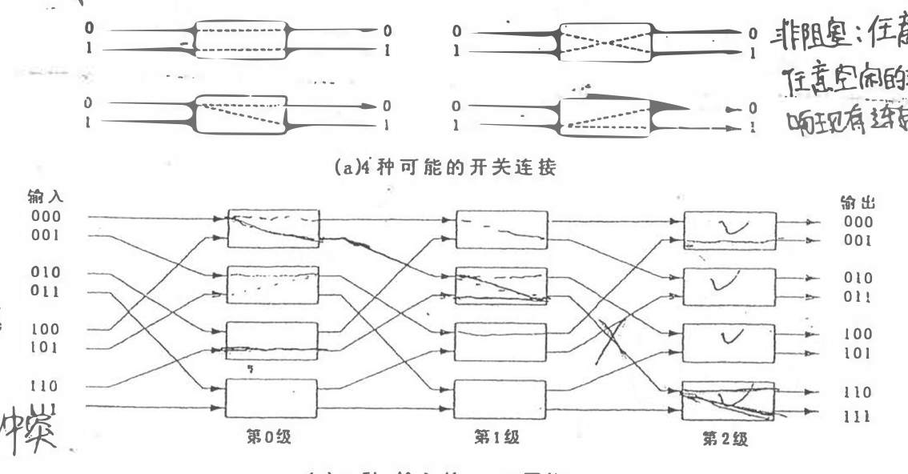

# 基础

## 请描述并行计算机中主要的访存结构模型

> 第一版P36-P38

- UMA:均匀存储访问模型，所有处理机访问任何存储字取相同的时间
- NUMA:非均匀存储访问模型，处理器访问存储器的时间不同，访问本地存储器或者群内共享存储器较快，访问外地存储器或者全局共享存储器较慢
- COMA:全高速缓存存储访问，NUMA的一种特例，各个处理器节点没有存储层次结构，全部高速缓存组成了全局地址空间，利用分布的高速缓存目录进行远程高速缓存的访问
- CC-NUMA:高速缓存一致性非均匀存储访问模型，基于高速缓存一致性协议
- NORMA:非远程存储访问模型，所有的存储器均为私有，只能自己访问

## 请比较可扩放性评价中的集中评价标准

> 第一版P128

等效率是效率不变的前提下研究问题规模随处理器数的变化；等速度是在保持平均速度不变的前提下研究处理器数增多的时候应当对应增加的工作量；平均延迟标准是在效率不变的前提下，用平均延迟的比值来标志随着处理器数增加需要增加的工作量。

三者的基本出发点均为抓住影响算法可扩放性的基本参数$T_o$。等效率使用解析计算的方式得到；等速度将$T_o$隐藏到所测量的执行时间中；平均延迟则是保持效率为恒定值，通过调节W和P来测量并行和串行的执行时间，最终通过平均延迟反应得到$T_o$。

故等速度和平均延迟标准均辅之以测试手段得到有关参数；等效率标准通过解析计算$T_o$。

> 缩写by ChatGPT:等效率、等速度、平均延迟标准分别研究问题规模随处理器数变化、处理器数增多应对应增加的工作量、随处理器数增加需要增加的工作量，均以$T_o$为基本参数。等效率使用解析计算，等速度将$T_o$隐藏到执行时间中，平均延迟通过调节W和P测量并行和串行执行时间，最终反应$T_o$。等速度和平均延迟标准通过测试手段得到有关参数，等效率标准通过解析计算$T_o$。

## 请描述并行程序设计中任务划分的几种主要方法

> P139

- 域分解：也叫数据划分，所要划分的对象为数据，这些数据可以是算法的输入、计算的输出或者中间结果。域分解的步骤为：首先分解与问题相关的数据，在可能的情况下使得这些小的数据片尽可能大致相等；再将每个计算关联到它所操作的数据上。这样划分产生一系列任务，每个任务包括一些数据及其上的操作
- 功能分解：也被成为任务分解或者计算划分。首先关注被执行的计算；然后如果所做的计算划分是成功的，再继续研究计算所需的数据，若数据基本不相交则意味着划分成功；若数据具有相当的重叠，意味着必然有大量的通信，应当考虑数据分解。

## 请给出最小北向最后后算法

## 请举例为何下图所示网络不是非阻塞网络

> 本题的解法只需要找到一对冲突的输入/输出即可

在本题中，存在冲突的为$000\to 110$和$110\to 111$

## 请比较基于侦听的高速缓存一致性协议与基于目录的高速缓存一致性协议

- 侦听一致性协议利用了总线的两个特性：所有总线上的事务对所有的高速缓存控制器都是可见的；它们对所有的控制器都以相同的次序可见。该协议利用了在单机体系结构中已经存在的两个基本因素：总线事务和高速缓存块相关的状态转换图。该协议不适用于大型多处理机系统中，因为在多级互联网络中实习广播的代价很大
- 基于目录的高速缓存一致性协议通过维护一个全局目录，每次需要通过一致性命令来维护高速缓存一致性时利用全局目录只把一致性命令发送给特定的节点从而实现一致性协议。该协议可以通过将目录分布到各个节点上防止其成为瓶颈。

## 请描述SMP中不同的锁机制

- 简单的软件锁算法通过处理器指令集中支持的某种原子指令来实现的。最为典型的就是原子交换指令。例如使用Test&Set指令、Swap指令、Fetch&Op指令等来对一个特定的锁变量进行修改从而实现。现代的微处理器还支持LL和SC从而实现对一个变量的原子IO操作
- 简单的锁算法存在性能问题，故有了Test&Set lock with Backoff，降低Test&Set的发出频率，通过在两条Test&Set指令之间插入一个延迟时间进行实现或者通过Test-and-Test&Set实现，在忙等待的时候只使用Load读取锁变量的值，只有在读取到锁释放的时候才使用Test&Set去获取锁
- 更加先进的锁算法包括票锁，即每个锁进程持有一个票号，忙等待一个全局的Now-serving，只有Now-serving与自己的票号相同才能得到锁。且没有一个进程释放锁，Now-serveing才会+1。基于数组的锁通过Fetch&Increment指令去获得忙等待的一个位置，当锁释放的时候下一个位置上在忙等待的处理器将会通过读缺失知道自己获得了锁
- 全硬件的方式同样可以实现锁。

## 请描述基本的故障恢复测量，并具体说明何为非一致的全局检查点

故障恢复策略包括向后恢复，即恢复到上一个checkpoint和向前恢复，即利用日志重建状态。非一致的全局检查点即所有的进程独立进行检查点操作，各自设置检查点的时间完全独立。

# MESI和Dragon协议

## 2007
r1, r1, r1, r2, r2, r2, r3, r3, r3, w1, w1, w1, w2, w1, w1, w3, r3

MESI: T H H T H H T H H B H H T T H T H = 610
Dragon: T H H T H H T H H B B B B B B B H = 697

## 2008
r1, r1, r2, r2, r3, r3, r4, r4, w1, w1, w1, w2, w2, w3, w3, w4, w4

MESI: T H T H T H T H B H H T H T H T H
Dragon: T H T H T H T H B B B B B B B B B

## 分析过程
二者读取开销类似，每次未命中均为一次**块传输**，写入时MESI的第一次写入是一次总线事务，随后只要写入命中即为H，未命中时需要使用flush将数据刷新给其他缓存，是一次块传输T
Dragon在每次写入后均会触发一次Update，由于只Update更新的内容，故开销为一次普通总线事务，无论是否写命中均相同。

# 内存一致性
## 2007
根据三个程序的特征，可以确定，在输出最后两位的时候，至少有两个变量会被设置为非0值，且最后一个print所打印两个变量必然非0，故可以得到三种非法输出$$****00, ****0*, *****0$$
当完成前两位输出后，此时至少会有一个变量被设置为非0，且该变量一定会在后续两次输出中被输出，故可以知道中间两位必然全不为0，得到一种非法输出
$$**00**$$
根据上面的分析，可能的合法输出有
$$000111, 001011, 001111, 010111, 011011, 011111, 100111, 101011, 101111, 110111, 111011, 111111$$
当前两位均为0时，分析可知此时三个处理机必然有一个已经执行结束，而另外两个还未执行，分析中间两位，对于剩余两个未执行的处理机，中间两位为$01, 10, 11$均合法

当前两位为$01$时，此时可以知道在执行print的处理机之外还有某个处理机执行了赋值语句，此时可能的执行序列为`... P3.1 ... P1.2 ...`且在`P1.2`之前`P2.1`不能被执行，故中间两位可能的输出包括$10, 11$，同理假设其它可能的执行顺序，可以得到所有的可能输出包括$01, 10, 11$

同理，对于前两位为$10$的情况进行分析，可知中间两位的可能输出为$01, 10, 11$

当前两位为$11$时，此时可以知道三个赋值语句必然都被执行了，后续只存在一种合法输出，即$111111$

故最终所有的非法输出为$****00, ****0*, *****0, **00**, 110111, 111011$
其中$*$为通配符，可以为$0$或$1$

## 2008

根据题意，根据提议，(u, v, w)分别对应(B, A, C)，由于当u, v, w任意一个变量被赋值后，另外两个变量所对应的临时变量均会被改变为非0值，故对于任意一种0数量大于等于2的输出均为非法输出。

基于以上分析可以确定10种非法输出。

接下来考虑其他输出情况，输出中存在一个0的时候，可知对应输出的处理机必然在其他两个处理机开始执行之前完成执行，此时问题退化为两个处理机之间执行顺序的问题，故有$011, 102, 220$三者非法。

当输出中不存在0的情况，此时共有8中可能的输出，对其进行分别讨论

> 对于三个变量最终非0值的情况可以按照如下情况讨论
>
> P2.1 -> P3.1 ? B == 2 : B == 1
>
> P1.1 -> P3.2 ? A == 2 : A == 1
>
> P1.2 -> P2.2 ? C == 2 : C == 1
>
> 且若提前执行了对应处理机的第三句，则可以直接屏蔽上述判断

111: P3.1 P3.2 P2.1 P2.2 P1.1 P1.2 三个赋值任意进行

112: P3.1 P3.2 P2.1 P2.2 P3.3 P1.1 P1.2 剩余两个赋值任意

121: P3.1 P1.1 P3.2 P2.1 P2.2 P1.2 三个赋值任意执行

122: P1.1 P1.2 P3.1 P3.2 P2.1 P2.2 三个赋值任意执行

211: P2.1 P3.1 P3.2 P1.1 P2.2 P1.2 三个赋值任意执行

212: P2.1 P3.1 P3.2 P1.1 P1.2 P2.2 三个赋值任意执行

221: P2.1 P3.2 P1.1 P3.2 P2.2 P1.2 三个赋值任意执行

222: P2.1 P3.1 P1.1 P3.2 P1.2 P2.2 三个赋值任意进行

由此可得到所有的非法输出$*00, 0*0,00*, 000, 011, 102, 220$，其中$*$为通配符，可以为$0, 1, 2$的任意一个

# 路由

## 2008

> 多播路由中的编号计算方式
>
> - $y * n + x$ $y$为偶数
> - $y * n + n - x - 1$ $y$为奇数

# 预取

## 2007

> 纯靠经验，没有技巧，建议多推测

​    T1  T2  T3  T4  T5  T6  T7  T8  T9  T10 T11

​            F1      A1  B2  C1  D2  E1      F1

b1  **F1**  **F1**  F1  F1  **C1**  **C1**  C1  C1  **F1**  **F1**  F1

b2  **B2**  **B2**  B2  B2  B2  B2  **E1**  **E1**  E1  E1  E1

b3          A1  **A1**  A1  **D2**  **D2**  D2  D2  D2  D2